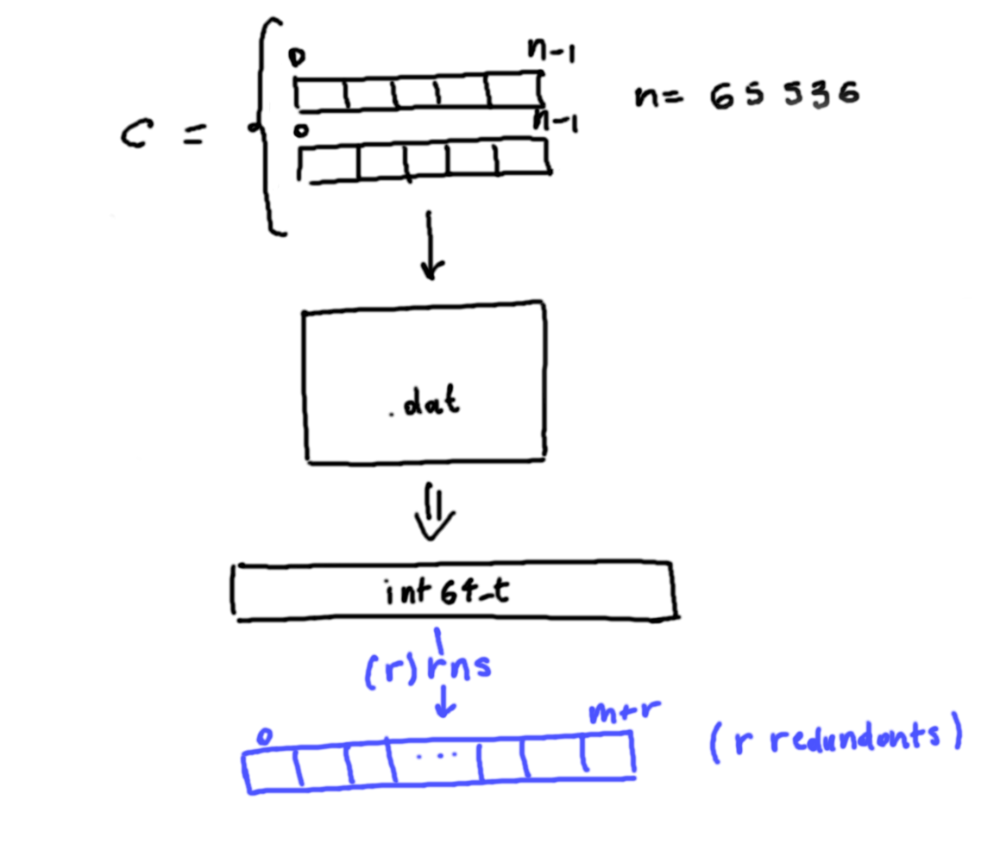

# Use of RRNS after encryption

## Approach
This scenario was introduced to try to reduce the burden of **sending multiple ciphers**, as in the case of converting into RNS before the encryption.

[**Serialization**](https://palisade-crypto.org/wp-content/uploads/2021/08/PALISADE-12-11-20-Serialization-Applications.pdf) is introduced, supported in PALISADE, to convert the ciphertexts into a **sequence of bytes** and then represent them into **redundant** RNS.

## First Draft

[main.cpp](https://github.com/ChiaraBn/Master-Thesis/blob/main/RnsAfterCrypto/main.cpp) contains the development for this first brief example. 
The use case is about a **sum** between two int numbers. 
It is also present a **comparison** between the presented approach and the one with the **serialization** usually used **without** the use of RNS. 

Cryptographic scheme used: **BGV**, due to the usage of int numbers.

## Problems
- Now there is just a **vector** of int64_t representing the **binary file**. It should be a **single** number, in order to encode it to the (R)RNS representation. 
This vector has size of 33703 elements. 
The serialized vector has size of 67406 elements.

## TODO
- Adapt it to the concrete scenario with GPS coordinates
- For a decentralized architecture is necessary to **send** the cryptocontext along with the keys (RSA).