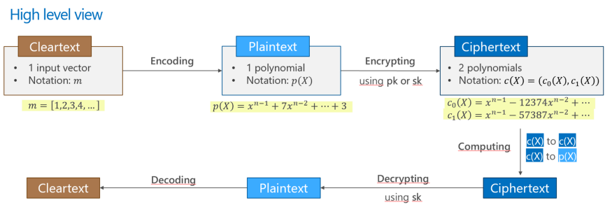
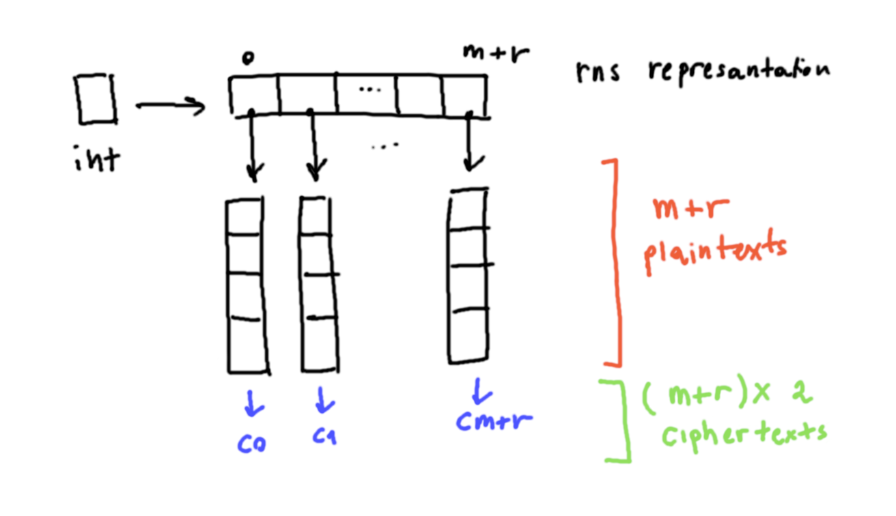

# Use of RRNS before encryption

## Approach
The approach involves sampling an integer data from a sensor, then transforming it into its RRNS representation and **encrypting each residue**.

The choice of using the RNS is based on the fact that, in front of having the possibility to have **redundant residues**, more data than necessary are prepared for sending, so that in case of architecture failures, there is the possibility to **recover** lost data.

## First draft

[PALISADE](https://palisade-crypto.org/) takes each residue and, in first action, trasforms them into a **polynomial Plaintext**, still representing the input text. 
Then, each residue is transformed into a **ciphertext**, which is actually a **pair** of **polynomials**.

[main.cpp](https://github.com/ChiaraBn/Master-Thesis/blob/main/RnsBeforeCrypto/main.cpp) contains the development for this first brief example.

## TODO

- Adapt it to the concrete scenario with GPS coordinates
- For a decentralized architecture is necessary to send the cryptocontext along with the keys (RSA).